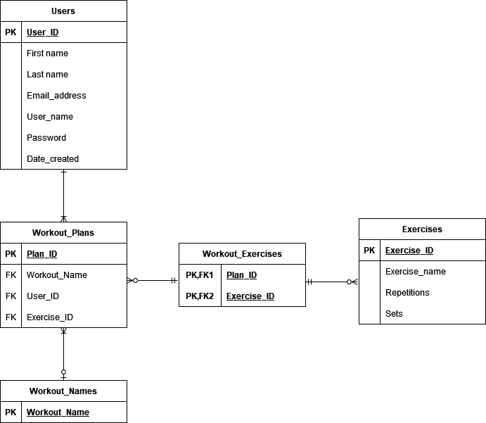

# My Workout App

## Resources

Jira Board: https://mhutt.atlassian.net/jira/software/projects/DP/boards/3

App: http://new-docker-server.uksouth.cloudapp.azure.com:5000/

Presentation: https://drive.google.com/file/d/1xljQow6f47StX0j4zAMjwfSz-w8vYFoH/view?usp=sharing

## The brief:

- Create a monolithic Flask application that serves both the frontend and backend of the application.

- The frontend aspect of the app will use HTML templates to serve the web pages that allow the user to perform CRUD functionality with information from the database.

- The backend aspect of the application will use SQLAlchemy to model and integrate with the database.

### An explanation of My Workout App and how it fulfils the brief:

My app allows users to build personalised workout plans from a database of exercises. They can create an account and they can log in to their account. On their account page, they can view or change their details and delete their account. 

Once logged in they can see all exercises in the database, with the option to update or delete each exercise in the form of a button. Users can also add their own exercises. Users can create a workout plan and add exercises from the exercise database to their workout plan. 

They can view exercises contained in each workout plan they create by selecting its name and for each exercise in that workout plan they have the option to delete that exercise from the workout plan. Workout plans are specific to the logged in user, so users cannot see other users' workout plans.

### A technical explanation of my app:

My Workout App is a monolithic Flask application factory serving both the frontend and backend of the application. It uses HTML templates to serve web pages with forms that allow the user to create an account (satisfies 'Create'), log in to that account with their email address and password (satisfies 'Read'), change their account details (including password, username and email address - satisfies 'Update'), and delete their account (satisfies 'Delete') by clicking buttons that call functions which query the attached mysql database and then perform said CRUD functions. Passwords are stored as hashes (SHA256) and passwords entered at the login page are hashed and then compared to hashes stored in the database for that user.

Once logged in, a user can create exercises by setting a name, number of repetitions, and number of sets (satisfies 'Create'). A separate template allows users to view, update and delete each exercise by clicking buttons under each exercise (satisfies 'Read', 'Update', and 'Delete'). All exercises in the database are visible regardless of current user ID.

They can also create a workout plan and then add any of those exercises to their workout by selecting them from a dynamically populated drop down list and then clicking submit. They can then select the workout plan they wish to view by navigating to the view workout hyperlink and selecting the workout name from another dynamically populated list (this queries the users table using the current user ID to ensure that only workouts created by that user can be viewed and then cross references that user ID with the foreign key user ID in the workout plans table). They are then redirected to a page showing all exercises contained in that workout plan.

As an addendum, when users delete their accounts, the database is queried so that every workout plan associated to that user is also deleted. This shows that CRUD is performed on multiple tables simultaneously to achieve the outcome of deleting the user.

Users can log out at any time by clicking the log out hyperlink, which will log the user out of the login manager and they will then be returned to the log in page.

## Architecture:

I initially thought that only three tables would be required to fulfil the brief, with a many-to-many relationship between users and exercises achieved through a workout programs join table:

### Initial entity relationship diagram:

However, during coding, I realised that an association table would be needed between exercises and workout plans as it is in fact a many-to-many relationship between workout plans and exercises. To expand, each workout plan can have many exercises, but each exercise can also be present in multiple workout plans. Thus, explaining the need for an association table. 

Similarly, I realised when creating the workout plan user stories that I would need to have a table specifically to manage workout plan names so that each workout plan could be viewed individually. This also meant that I could code the app to contain only those exercises in that specific workout plan as queried by the foreign key workout name. There is also a one-to-many relationship between users and workout plans, as each user can have many workout plans but each workout plan can only have one user.

### Final entity relationship diagram:

## Project Tracking with the Agile Scrum method using Jira:

Link to jira board: https://mhutt.atlassian.net/jira/software/projects/DP/boards/3

The project was tracked using Jira as mentioned above. Five epics were created to help guide development:

- App Setup: basic app set up of file structure and files

- Accounts: user stories for account related processes, e.g. log in, log out

- Exercises: user stories for exercise related processes, e.g. create exercise, update exercise

- Workout Plans: user stories for exercise related processes, e.g. create workout plan, add exercise to workout plan

- Testing: unit tests

### User stories with MoSCoW Prioritisation

### Must have:

-	As a user, I want to be able to create an account (2 story points)

-	As a user, I want to be able to view my account details (2 story points)

-	As a user, I want to be able to delete my account (2 story points)

-	As a user, I want to be able to create an exercise (2 story points)

-	As a user, I want to be able to view exercises (3 story points)

-	As a user, I want to be able to update an exercise (5 story points)

-	As a user, I want to be able to delete an exercise (5 story points)

-	As a user, I want to be able to create a workout plan (2 story points)

-	As a user, I want to be able to add an exercise to a workout plan (3 story points)

-	As a user, I want to be able to view my workout plan that I've created (8 story points)

### Should have:

-	As a user, I want to be able to log in to my account (8 story points)

-	As a user, I want to be able to update my account information (5 story points)

-	As a user, I want my passwords to be stored safely as hashes (3 story points)

-	As a user, I want to be able to remove an exercise from a workout plan (5 story points)

### Could have:

-	As a user, I want my passwords to be stored as salted hashes (3 story points)

### Won’t have:

-	As a user, I want to be able to add pictures of exercises for reference (13 story points)

-	As a user, I want to be able to reset my password via email if I’ve forgotten it (20 story points)

## A technical description of how the pipeline works:

The image above combines the continuous integration/continuous deployment process with the infrastructure diagram of the cloud network resources utilised, showing how source code located on a local machine is progressed into a fully functioning app deployed in a Docker Swarm Stack hosted on virtual machines. 

The source code is pushed from the local machine (in this case actually a VM connected to via openSSH using VS Code) to GitHub, our version control system and code repository. A webhook has been set up so that whenever code is pushed to GitHub, a jenkins server located on an Azure VM is alerted to start the code integration process. It will set up the build environment and download and install the necessary dependencies and requirements. At this point, pytest unit tests are automatically carried out to ensure the app is functioning as intended. A testing log is produced.

This is all carried out using a Jenkins pipeline, whereby each stage is designed separately and executed consecutively. If a stage within the pipeline fails, the job will also fail and no further stages will be carried out. A comprehensive log of information is produced for each stage showing the commands and their output as they are executed. If a job does fail, the output will usually help one to ascertain the likely cause for the failure so that it can be remedied. Below is an example of the log from a successful build:

## The stages for my build are as follows:

- Declarative: Checkout SCM - code is pulled from GitHub repo when webhook triggers

- Setup - downloads and installs dependencies if necessary and activates virtual environment, logs into Docker Hub for image push later

- Testing - runs pytest on all unit tests in repository

- Build - runs docker-compose to build container images from docker-compose.yaml 

- Push - pushes newly built containers to Docker Hub

- Deploy - deploys Swarm Stack app and mysql database on two Azure VMs

- Post-Build Stage - JUnit pytest result publishing

Below is the stage view of the build history:

## Risk Assessment

A comprehensive risk assessment was carried out to ascertain probability of risks, their level of impact, and how the current design mitigates these risks. If no mitigation is currently implemented or the mitigation is lacking, new measures are proposed with an explanation of how to respond to each risk in the event that it occurs.

link to risk assessment document: https://docs.google.com/spreadsheets/d/1Pag4wGeVzmgAjZ8MECAAxV3mnXmgz78rG5Xsoh7VgOM/edit#gid=0

Here is a picture to demonstrate the layout of the document:

## Unit Testing

Testing was somewhat problematic due to the log-in system. I could not find a way to replicate the log-in process within the testing context, so had to disable this functionality in order to get tests to pass. This meant that I could not properly test any of the login functionality, e.g. logging in, logging out, but this also meant that I could not test functions which required the id of the currently logged in user. This affected functions such as adding an exercise to a workout plan, as each workout plan is specific to the currently logged in user.

Despite this, I managed to get test coverage up to 77%, which all things considered is satisfactory. All views are tested and most create functions are tested with success. Read functions are also tested with some success. Going forward, I would need to further research and understand the flask login manager and how it is called in testing contexts in order to implement authentication testing.

Moreover, I experienced issues trying to test update and delete functionality across the board. Tests were written in line with standard CRUD testing procedure for Flask Apps, but for some reason these functions were still missing from the coverage report. I could not find a satisfactory reason for this.

## Future Improvements

I would like to improve this app in the following ways:

- If possible, it would be nice to include links to short videos of someone demonstrating each exercise as a column in the exercises table
- I would like to include functionality for adding weights for each set of an exercise as they are added to the workout plan, if applicable. For example, for 5 sets of 8 repetitions of Bench Press with a different weight for each set (55, 60, 65, 70, 75)
- I would like users to be able to track workouts within the app, such that they can mark exercises as completed and even record how many sets and reps they did at what weight
- I would like to add a feature for users to add their height and weight, with an option to track weight over time so that they can see how much weight they've gained (if bulking) or lost (if cutting) over a specific time period
- I would like to show users their BMI based on their height and weight in their profile, perhaps even with body fat percentage for a more accurate BMI
- I would like to build a system whereby users can reset their password if they have forgotten their login details by entering their email address. This would likely involve building an SMTP server which could be interesting to implement alongside Flask.
- Add functionality for salted hashed passwords
